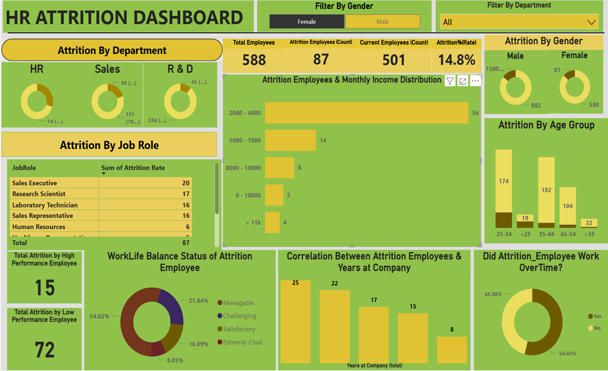

# POWER-BI-Project1_HR-Attrition-Dashboard
### Objective
This project aims to develop a Power BI Dashboard to comprehend employee attrition and explore the factors contributing to turnover, facilitating the development of effective retention strategies. The goal is to enhance retention and strengthen the workforce through actionable insights presented in the dashboard.

#### Dataset
The dataset, sourced from Kaggle, IBM HR Analytics Employee Attrition & Performance, includes details such as employee demographics, job attributes, performance ratings, and attrition status, facilitating analysis and understanding of turnover factors.
### Steps Undertaken
**1.Setting Objectives:**
- Clarified scope and objectives, aiming to gain insights into employee attrition patterns.

**2. Data Collection and Exploration:**
- Gathered HR attrition dataset from Kaggle.
- Analyzed the dataset to gain insights into employee demographics, job attributes, performance ratings, and attrition status. This involved visualizing distributions, correlations, and trends using descriptive statistics and data visualization techniques.

**3. Metric Development:**
- Utilizw Power BI Desktop and Data Analysis Expressions (DAX) to create key performance indicators (KPIs) such as attrition rate, department-wise turnover, etc.

**4. Dashboard Creation:**
- Developed an interactive dashboard in Power BI Desktop to visualize the analysis results. The dashboard includes various visualizations, filters, and slicers to facilitate exploration and understanding of employee attrition patterns.

### Questions

1. What is the overall attrition rate, and how does it vary by gender?
2. Which age group experiences the highest attrition?
3. How does attrition vary across different departments?
4. Which job roles have the highest attrition rates?
5. What is the correlation between years of service at the company and attrition?
6. How does monthly salary affect attrition? Does a low salary lead to high attrition?
7. Is there a relationship between overtime work and attrition?
8. Is there a difference in attrition rates between high-performance and low-performance employees?
9. How does the work-life balance affect attrition? Do employees tend to quit when work-life balance is low?

### Key DAX Measures 
1. Attrition Percentage = DIVIDE([Attrition_Employee], [Total Employees])
2. Female Attrition = CALCULATE([Attrition_Employee], 'HR-Employee-Attrition'[Gender]="Female")
3. Sales_Dep_Attrition = CALCULATE([Attrition_Employee], 'HR-Employee-Attrition'[Department]="Sales")
4. High_Performance_Employees = CALCULATE([Attrition_Employee], 'HR-Employee-Attrition'[Performance Rating Status]="High")

   Categorical binning (Age Group, Salary Slab, Distance from Home, Work-Life Balance Status) was handled via conditional columns in Power Query, converting    continuous numeric fields into business-readable segments for slicing in the dashboard.

### Key Findings
1. Overall attrition rate: **16.1%** (237 of 1,470 employees)
2. Employees working overtime left at nearly **3x the rate** of those who didn't (30.5% vs 10.4%) — the strongest predictor in the dataset
3. **Sales Representatives** had the highest attrition by role at **39.8%**, over 15x higher than Research Directors (2.5%)
4. Employees **under 25** left at **39.2%**, more than double the overall rate
5. Departing employees earned roughly **30% less on average** ($4,787 vs $6,833/month) and had shorter tenure (5.1 vs 7.4 years) than those who stayed
6. Performance rating showed almost no relationship to attrition (16.1% vs 16.4%) — the company isn't losing its top performers, it's losing overworked, underpaid, and early-career employees

### Recommendation
Prioritize overtime monitoring and workload redistribution in Sales, and build a structured onboarding/retention track for employees under 25 and in their first two years — the two segments driving the majority of preventable turnover. Since performance rating isn't a differentiator, retention efforts should focus on compensation review and workload management rather than performance-based interventions.

